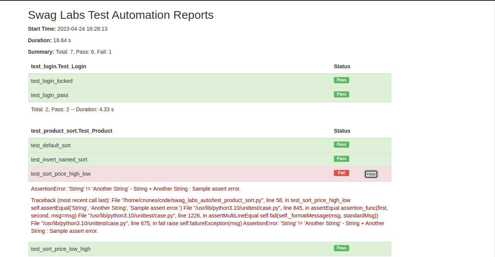

# Swag Labs Test Automation

## Screen record of tests running

## HtmlTestRunner Report Sample

## Automation Test Plan

### Introduction
This document outlines the automation testing plan for the Swag Labs, a web application for
shopping.

### Objectives
The objectives of automation testing for the Swag Labs are as follows:
- To ensure that the Swag Labs application is stable and reliable.
- To increase the speed of testing and reduce manual effort.
- To reduce the overall cost of testing.
- To ensure that all items added to cart are going to checkout.
- To ensure that the prices are correct.

### Scope
The scope of automation testing includes:
- Functional testing of all modules.
- Regression testing of all modules.

### Automation tool
The automation tool selected for this project is Selenium version 4.8.3 with programming language python.

### Test environment
The test environment for automation testing is as follows:
- Operating system: Ubuntu 22.04.2 LTS (Jammy Jellyfish)
- Browser: Google Chrome Version 112.0.5615.49
- Programming language: python
- Integrated Development Environment: VS Code

### Test cases
The following test cases will be automated:
1. Login to the application
2. Sort products
3. Add and remove products from the cart
4. View product detail
5. Edit product quantity
6. Checkout

### Test data
The following test data will be used for automation testing:
- Usernames and passwords
- User information (First name, Last name, Zip/Postal Code)

### Test execution
The automation testing process will follow the below steps:
1. Identify the test cases to be automated.
2. Develop automation scripts for identified test cases.
3. Execute the automation scripts.
4. Analyze the test results.
5. Report and track defects, if any.

### Risks and mitigation
The following risks are identified:
- Environment: if the tests run in a production environment, it can lead to unintentional
purchases, improper billings, stock mismatch. To mitigate this risk, the base URL will
be set in the file cypress.config.js.
- User data exposing: to mitigate this risk, the user data will be created just for the
testing automation.
- Changes in the web elements: this can lead to element not found errors. To mitigate
this risk the web locators will be organized in a different file in a dynamic way.

### Conclusion
The automation test plan outlines the strategy for automation testing of the Swag Labs
application. This plan will ensure that the application is stable and reliable. The plan will also
reduce the overall cost of testing and speed up the testing process.
